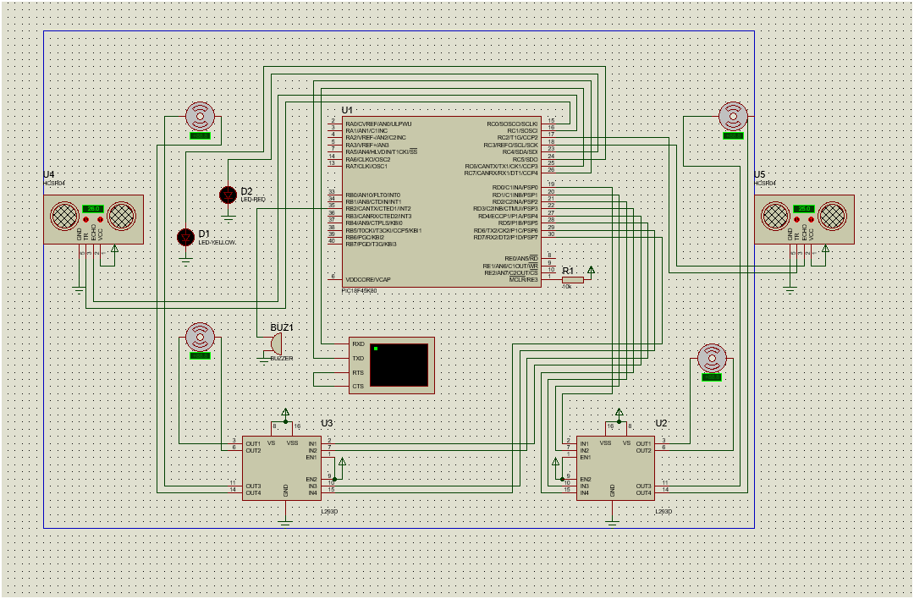

# Traffic_AMR – Automated Mobility Robot for Traffic Barrier System

## 📌 Overview
The **Traffic_AMR** project is an **Automated Mobility Robot** designed to control and automate traffic barrier operations.  
It uses ultrasonic sensors for obstacle detection, motor drivers for movement control, and LED indicators for motion status.  
This system can be controlled via serial commands (`R`, `L`, `S`) and includes safety features to prevent collisions.

---

## 🚀 Features
- **Left & Right Movement** with obstacle avoidance.
- **Ultrasonic Sensor Integration** for distance measurement.
- **LED Indicators:**
  - **Yellow LED**: Warning before movement.
  - **Red LED**: Indicates motion in progress.
- **Buzzer Alert** (optional, can be enabled in code).
- **Serial Command Interface**:
  - `R` → Move Right
  - `L` → Move Left
  - `S` → Stop
- **Safety Timeout** to automatically stop after a set duration.

---

## 🛠 Components
Refer to [`Component Req and Cost Analysis.pdf`](docs/Component%20Req%20and%20Cost%20Analysis.pdf) for the detailed Bill of Materials (BOM).

**Key Components:**
- PIC Microcontroller (with MCC-generated configuration)
- Ultrasonic Sensors (HC-SR04 or equivalent)
- Motor Driver (L298N or equivalent)
- DC Motors
- LEDs (Red, Yellow)
- Buzzer (optional)
- Serial Communication Module (EUSART1)
- Power Supply

---

## ⚙️ Hardware Setup


- **Ultrasonic Sensors**:
  - Sensor 1: TRIG → RC0, ECHO → RC1
  - Sensor 2: TRIG → RC2, ECHO → RC3
- **LEDs**:
  - Red LED → RC4
  - Yellow LED → RC5
- **Motors**:
  - Controlled via `LATD` pins for forward/backward motion.
- **Buzzer**:
  - Optional, can be connected to RB0.

---

## 📂 Project Structure
Traffic_AMR/
│
├── docs/
│ ├── Automated Barrier System A Comprehensive Overview.pdf
│ ├── Component Req and Cost Analysis.pdf
│
├── firmware/
│ ├── Traffic_AMR.X/ # MPLAB X project folder
│ └── main.c # Main firmware source code
│
├── simulation/
│ ├── TRAFFIC_AMR.pdsprj # Simulation project file
│ └── circuit.png # Circuit diagram
│
└── README.md

---

## 💻 Firmware Details
- **Language**: C (XC8 Compiler)
- **IDE**: MPLAB X
- **Code Generator**: MCC (MPLAB Code Configurator)
- **Core Logic**: [`main.c`](firmware/Traffic_AMR.X/main.c)
- **Ultrasonic Measurement**: Timer1 pulse width calculation.
- **Motor Control**: `LATD` outputs to H-Bridge.
- **Safety**: Stops immediately if distance < `OBSTACLE_DISTANCE_CM` (20 cm default).

---

## 🔧 How to Run
1. Clone the repository:
   ```bash
   git clone https://github.com/asoleshubham0125/Traffic_AMR.git
2. Open Traffic_AMR.X in MPLAB X.
3. Build using XC8 Compiler.
4. Flash the .hex file to the PIC18F45K80.
5. Connect the hardware as shown in circuit.png.

6. Open a serial terminal (9600 baud) and send:
- R → Move Forward
- L → Move Backward
- S → Stop

---

## 📄 Documentation
- [Automated Barrier System – Comprehensive Overview](docs/Automated%20Barrier%20System%20A%20Comprehensive%20Overview.pdf)
- [Component Requirements & Cost Analysis](docs/Component%20Req%20and%20Cost%20Analysis.pdf)

---

##👤 Author
Shubham Asole
📧 asoleshubham01@gmail.com
🔗 GitHub Profile

